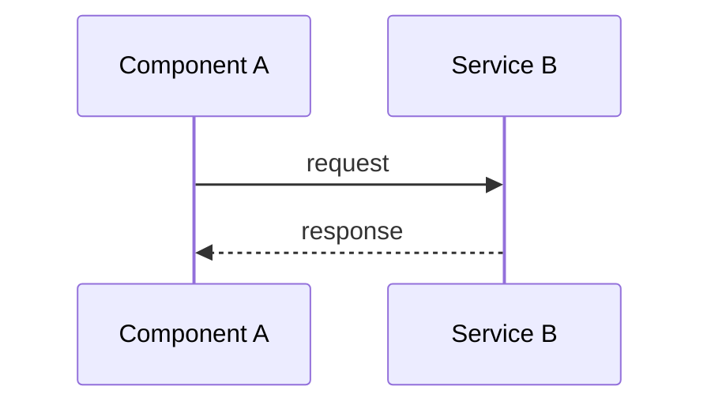

## Overview

[Summarize in 1–3 sentences what this plan delivers, why it matters, and how
success will be measured.]

## Scope

### In scope

- [Deliverable or behavior included in this plan]

### Out of scope

- [Explicitly excluded work]

## High-Level Technical Design

> This section is directional guidance for review, not an implementation
> specification to copy. The builder determines final names, abstractions, and
> code structure while preserving the stated behavior and constraints.

Provide one concise design view:

**Mermaid diagram:**



**Or pseudo-code:**

```text
on user_action:
  validate input
  if valid:
    process and store
    trigger event
  else:
    return error
```

**Or data-flow map:**

```text
User Input → Validation → Processing → Storage → Notification
```

## Acceptance Criteria

Write criteria as observable, independently verifiable behaviors. Every
criterion must have at least one automated test listed in the test matrix below.

- AC-001: [Single, observable behavior]
- AC-002: [Single, observable behavior]

## Acceptance-Criterion-to-Test Matrix

| ID | Acceptance criterion | Test file or test name | Test level | Expected initial state | Result |
|---|---|---|---|---|---|
| AC-001 | [Criterion] | `[path]` / `[test name]` | unit / integration / system | failing or not yet implemented | pending |
| AC-002 | [Criterion] | `[path]` / `[test name]` | unit / integration / system | failing or not yet implemented | pending |

The planner must not mark this plan `ready` while an acceptance criterion has
no meaningful test. Each test must exercise the stated behavior and must be
capable of failing when that behavior is absent or broken.

## Reviewer Assignment

Select reviewers using the task type, affected files, complexity, and risk.
Record both assigned and explicitly skipped roles.

| Reviewer role | Assigned? | Reason | Required evidence |
|---|---|---|---|
| Security | yes/no | [Reason] | [Evidence] |
| UX | yes/no/not applicable | [Reason] | [Evidence] |
| UI design | yes/no/not applicable | [Reason] | [Evidence] |
| Code | yes/no | [Reason] | [Evidence] |
| Accessibility | yes/no | [Reason] | [Evidence] |
| Data | yes/no | [Reason] | [Evidence] |
| Infrastructure | yes/no | [Reason] | [Evidence] |
| Performance | yes/no | [Reason] | [Evidence] |

Higher complexity and risk require broader review coverage and deeper test
coverage. A skipped UX or UI design review is valid only when the feature has
no meaningful user interface.

## Implementation Units (Phased)

### Phase 1: Foundation

- U1. **[Unit name]**
  - **Goal:** [What this unit accomplishes]
  - **Dependencies:** None
  - **Files:**
    - Create: `path/to/file`
    - Test: `path/to/test`
  - **Acceptance criteria:** AC-001
  - **Test-first steps:**
    1. Add or update the test for AC-001.
    2. Run it and record the expected failing result when supported.
    3. Implement the smallest change that makes it pass.
    4. Refactor without weakening the test.

- U2. **[Unit name]**
  - **Goal:** [What this unit accomplishes]
  - **Dependencies:** U1
  - **Files:**
    - Create or modify: `path/to/file`
    - Test: `path/to/test`
  - **Acceptance criteria:** AC-002
  - **Test-first steps:** [Describe the red-green-refactor sequence]

### Phase 2: Integration

- U3. **[Unit name]**
  - **Goal:** [What this unit integrates]
  - **Dependencies:** U1, U2
  - **Files:**
    - Modify: `path/to/file`
    - Test: `path/to/test`
  - **Acceptance criteria:** [AC-xxx]
  - **Test-first steps:** [Describe the integration test sequence]

### Phase 3: Rollout (if applicable)

- U4. **[Unit name]**
  - **Goal:** [What is released, migrated, or enabled]
  - **Dependencies:** U3
  - **Files:**
    - Modify: `path/to/file`
    - Test: `path/to/test`
  - **Acceptance criteria:** [AC-xxx]
  - **Test-first steps:** [Describe rollout and rollback verification]

## Test Strategy and Commands

### Test layers

- Unit: [What is covered and where]
- Integration: [What is covered and where]
- System or end-to-end: [What is covered and where, if applicable]
- Regression: [Existing behavior that must remain intact]

### Commands

```text
# Install or prepare dependencies
[command]

# Run focused tests
[command]

# Run the complete suite
[command]
```

### Test data and environment

[Fixtures, seeds, mocks, services, credentials, or environment assumptions.]

## Alternatives Considered

- **[Approach name]:** [Description] — **Rejected because:** [Rationale]
- **[Approach name]:** [Description] — **Rejected because:** [Rationale]

## Risk Analysis and Mitigation

| Risk | Impact | Mitigation | Owner or trigger |
|---|---|---|---|
| [Specific risk] | High / Medium / Low | [Concrete prevention or recovery] | [Owner or signal] |

## Operational and Rollout Notes

- Feature flags: [Flag and default behavior, if applicable]
- Monitoring: [Metrics, logs, alerts, or dashboards]
- Data migration: [Migration and verification steps, if applicable]
- Rollback plan: [Safe rollback procedure]
- Performance baseline: [Expected throughput, latency, or resource target]

## Definition of Done

- [ ] All implementation units are complete.
- [ ] Every acceptance criterion has a meaningful automated test.
- [ ] Tests pass using the commands documented above.
- [ ] Security, UX, UI-design, and code reviews are complete where applicable.
- [ ] Documentation and operational notes are updated.
- [ ] The approver report is stored at `docs/review/<job-id>-round-<n>.md`.
- [ ] The plan’s human approval metadata is complete before building starts.
- [ ] Important durable learnings are stored under `docs/learnings/`, or the
      review report records that none were identified.

## Related Learnings

- **[Learning title]** — `docs/learnings/[filename].md` — [Applicability note]
- None identified.

## Learning Gaps

- [Question or gap to investigate during implementation or review]
- None identified.

## Plan Amendments

| Date | Version | Change | Reason | Approved by |
|---|---|---|---|---|
| YYYY-MM-DD | 1.1 | [Change] | [Reason] | [Approver] |
